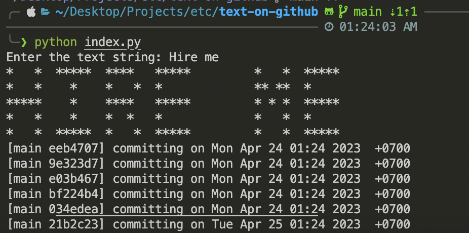
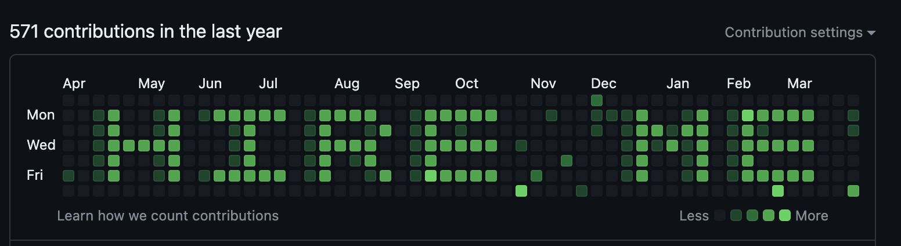

# GitTypography

GitTypography is a creative Python script that transforms your GitHub heatmap into a work of art. Using this tool, you
can spell out words, create patterns, or even render simple images directly on your GitHub contribution graph, turning
it into a unique display of creativity that enhances your GitHub profile.

## Features

- **Simple String to Heatmap Typography:** Convert simple strings into visually appealing designs on your GitHub
  heatmap.
- **Image to Heatmap Conversion:** (Upcoming) Convert images into grayscale and map them onto your heatmap for a more
  complex and detailed representation.
- **Safe for Your Repos:** Operates without interfering with your actual project commit history.

## Art Dimensions

To accurately represent the art on your GitHub heatmap, any input string or image will be rendered within the confines
of a 7x52 grid, which mirrors the 7 days of the week and the 52 weeks displayed on the heatmap. This ensures that your
creations will fit perfectly within the GitHub heatmap display.

## Result

## Input

To demonstrate the usage of GitTypography, let's consider the following input:



## Output

Here is an example of the output generated by GitTypography:



## Getting Started

### Prerequisites

- Python 3.6+
- A GitHub account

### Installation

1. Clone the repository:
   ```sh
   git clone https://github.com/HAckeRSHIL/text-on-github.git
   ```
2. Navigate to the text-on-github directory:
   ```sh
   cd text-on-github
   ```
3. Update .env file with your GitHub token:
   ```sh
   GITHUB_TOKEN=ghp_your_github_token
   ```
   Replace `ghp_your_github_token` with your github token

### Usage

Run the script and enter your desired text when prompted. Follow the steps below:

1. Start the script:
   ```sh
   python index.py
   ```
2. When prompted, enter the text string you wish to display on your GitHub heatmap:
   ```plaintext
   Enter the text string: [YourTextHere]
   ```
   Replace `[YourTextHere]` with the text you want to be displayed.
3. The script will process your input and perform the necessary git commits to create the typography on your heatmap.

Note: Ensure you have set up your GitHub repository and local git configuration properly before running the script. The
commits will be made to the repository and reflected on your heatmap accordingly.

## Contributing

We welcome contributions of all kinds! If you're interested in making GitTypography even better, consider:

- Reporting a bug
- Discussing the current state of the code
- Submitting a fix
- Proposing new features
- Becoming a maintainer

## Resolutions Checklist: If you don't see changes in heatmap

- [ ] Check the git configuration for the correct email address:
    - Run the following command to check the email address associated with your git configuration:
      ```sh
      git config user.email
      ```
    - Make sure the email address returned matches the email address associated with your GitHub account.
    - If they don't match, you can set the correct email address using the following command:
      ```sh
      git config --global user.email "your-email@example.com"
      ```
- [ ] Verify that the commits are being made on the correct branch:
    - Check the branch you are currently on by running the following command:
      ```sh
      git branch
      ```
    - Make sure you are on the branch that corresponds to your GitHub repository.
    - If you are on a different branch, you can switch to the correct branch using the following command:
      ```sh
      git checkout branch-name
      ```
      Replace `branch-name` with the name of the branch you want to switch to.

## Acknowledgments

- I wanna thank me for believing in me
- Fellow friends
- That random youtube tutorials
- That cheap and effective (student friendly) : Taco Veg Fiesta

Feel free to express your creativity with GitTypography and share your unique GitHub heatmap designs with us!
